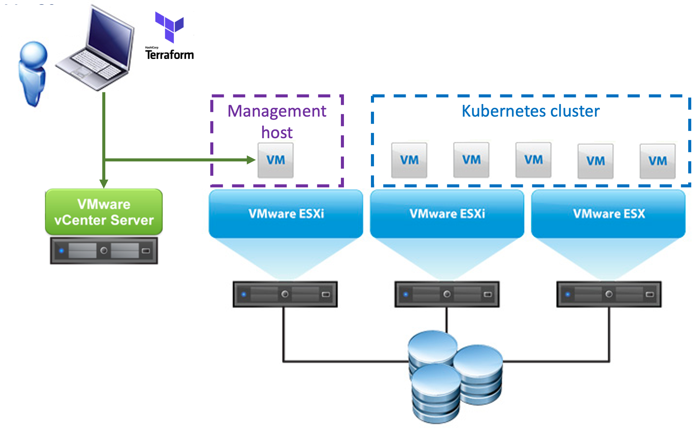
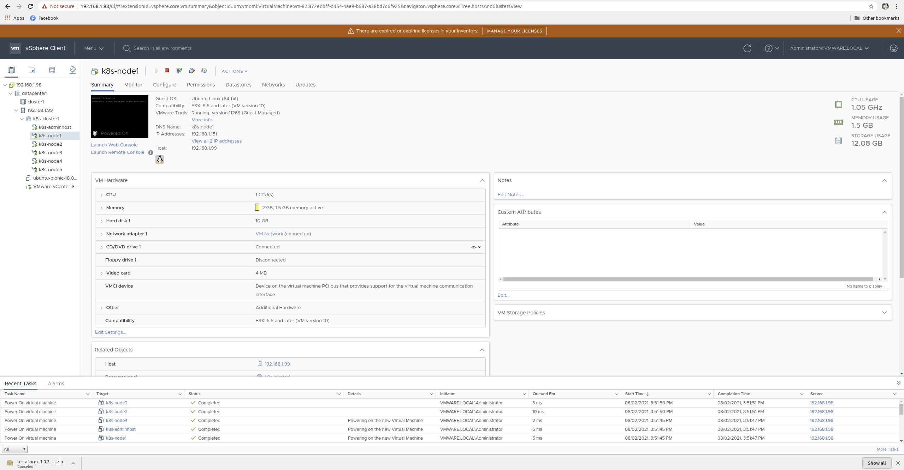

# Deploy Kubernetes on VMware vSphere using Terraform and Kubespray
k8s on VMware vSphere : a simple Terraform based automated deployment of k8s based on Kubespray deployment. This Terraform project allows you to deploy Kubernetes on vSphere. It uses Kubespray for the deployment and allows you to tweak of the deployment options.

## What does this project do?
This Terraform project will automatically create VM's on VMware vSphere required to deploy Kubernetes using Kubespray. Then it will download Kubespray and prepare the nodes. Finally it can automatically run Kubespray to deploy Kubernetes, but you can also choose to hold-of with the Kubespray deployment (see the `run_kubespray` parameter in `variables.tf`, by default run_kubespray = "no"), so that you can tweak the Kubespray parameters. Once have the correct settings in place for Kubespray you can run Kubespray with a single command (`~/run_kubespray.sh`) to deploy Kubernetes.



Once the deployment is done you get an Administrative Linux VM, which contains the Kubespray software in it's home directory, so that you can maintain the cluster afterwards. It can also be used to run `kubectl` and access your Kubernetes environment.
Besides the Administrative Linux VM, it will create the number of Kubernetes nodes you have specified (see `number_of_nodes` parameter in `variables.tf`) and deploy Kubernetes on those nodes.

## VMware vSphere environment install/setup requirements

Install ESXi 6.7/7, deploy VMware vCenter Server Appliance  6.7/7(VCSA) as ESXi VM, create datacenter and add ESXi hosts to it.

## Local system requirements (laptop/workstation)

To be able to apply this Terraform configuration to your vSphere environment, make sure you have to following requirements in place. Basically all you need are git, for cloning the github repo and the Terraform binary to run the playbook.

### Linux:

- Install Terraform, see https://learn.hashicorp.com/terraform/getting-started/install.html for instructions.

  Example steps for installing Terraform (latest version):
  ```
  curl -O https://releases.hashicorp.com/terraform/{VERSION}/terraform_{VERSION}_linux_amd64.zip
  unzip terraform_{VERSION}_linux_amd64.zip
  sudo mkdir -p /usr/local/bin
  sudo mv terraform /usr/local/bin/
  ```

  Test the Terraform installation (this command should return the Terraform version installed):
  
  `terraform -v`
  
## Deployment procedure
The following steps need to be executed in order ot deploy Kubernetes using this Terraform configuration to your VMware vSphere environment.

1. Download an Ubuntu Cloud image OVA (http://cloud-images.ubuntu.com/bionic/current/bionic-server-cloudimg-amd64.ova) and add that to your vSphere environment as template virtual machine (Deploy OVF Template -> REF: https://www.d-nix.nl/2021/04/using-the-ubuntu-cloud-image-in-vmware/). Create k8s cluster resource pool to your vSphere environment (k8s-cluster1 for example).
2. The first step is to download this repo to you workstation.

   ```
   git clone https://github.com/adavarski/k8s-vmware-terraform-kubespray.git
   ```   
   
3. Change the `variables.tf` file to match your environment (see https://github.com/adavarski/k8s-vmware-terraform-kubespray/blob/master/docs/variables.md).
   - Specify your vCenter server details, cluster, datastore and networking details in the `vsphere_config` section;
   - If you which make changes to the `k8s-global` settings or the `k8s-adminhost` settings if you want;
   - Make sure you set the correct iscsi_subnet (if you require it) in the `k8snodes` section.
4. Deploy Kubernetes using Terraform by executing the following commands:
   - First we need to initialize terraform (downloading the required Terraform providers for this project)
   
     `terraform init`
     
   - Secondly we need to plan the terraform project, to make sure we are ready to deploy. You might get some errors on your vSphere environment details if you made a mistake in the variables.tf file.
   
     `terraform plan`
     
   - Finally apply the project, at which point the VM's and Kubespray are being deployed.
   
     `terraform apply`
     
Example:
```
$ terraform apply

An execution plan has been generated and is shown below.
Resource actions are indicated with the following symbols:
  + create
 <= read (data resources)

...

null_resource.generate-sshkey: Creating...
null_resource.generate-sshkey: Provisioning with 'local-exec'...
null_resource.generate-sshkey (local-exec): Executing: ["/bin/sh" "-c" "mkdir -p $(dirname keys/id_rsa-k8s-on-vmware)"]
null_resource.generate-sshkey: Provisioning with 'local-exec'...
null_resource.generate-sshkey (local-exec): Executing: ["/bin/sh" "-c" "yes n | ssh-keygen -b 4096 -t rsa -C 'k8s-on-vmware-sshkey' -N '' -f keys/id_rsa-k8s-on-vmware"]
null_resource.generate-sshkey (local-exec): Generating public/private rsa key pair.
null_resource.generate-sshkey (local-exec): keys/id_rsa-k8s-on-vmware already exists.
null_resource.generate-sshkey (local-exec): Overwrite (y/n)?

null_resource.generate-sshkey: Creation complete after 0s [id=6695836002409884287]
data.local_file.ssh-publickey: Reading...
data.local_file.ssh-privatekey: Reading...
data.local_file.ssh-privatekey: Read complete after 0s [id=7c1c40fd1f91f9b5144b6d9c44e5d4d585be1225]
data.local_file.ssh-publickey: Read complete after 0s [id=60bc3ef9032c456aa7ca253f5cdcfbc91821d56d]
vsphere_virtual_machine.k8s-nodes[0]: Creating...
vsphere_virtual_machine.k8s-adminhost: Creating...
vsphere_virtual_machine.k8s-nodes[3]: Creating...
vsphere_virtual_machine.k8s-nodes[1]: Creating...
vsphere_virtual_machine.k8s-nodes[2]: Creating...
vsphere_virtual_machine.k8s-nodes[4]: Creating...

...

null_resource.prepare-kubespray: Still creating... [1m50s elapsed]
null_resource.prepare-kubespray (remote-exec): Successfully installed MarkupSafe-1.1.1 ansible-3.4.0 ansible-base-2.10.11 cffi-1.14.6 cryptography-2.8 jinja2-2.11.3 jmespath-0.9.5 netaddr-0.7.19 packaging-21.0 pbr-5.4.4 pycparser-2.20 pyparsing-2.4.7 ruamel.yaml-0.16.10 ruamel.yaml.clib-0.2.2
null_resource.prepare-kubespray: Still creating... [2m0s elapsed]
null_resource.prepare-kubespray (remote-exec): Using default Kubespray version for Kubernetes deployment
null_resource.prepare-kubespray: Creation complete after 2m1s [id=5994520031113162565]

Apply complete! Resources: 10 added, 0 changed, 0 destroyed.

Outputs:

k8s-adminhost-ip = "192.168.1.150"
k8s-node-ips = [
  "192.168.1.151",
  "192.168.1.152",
  "192.168.1.153",
  "192.168.1.154",
  "192.168.1.155",
]

```



     
## Working with the deployment
Once the deployment is complete you can start using it. 

**Get the IP addresses**
The previous `terraform apply` command will return the IP addresses of the Administrative host and the Kubernetes nodes, however if you missed that message, use the following command to get the IP addresses for the deployment.

`terraform output`

**Logon to the administrative host**
To logon to the administrative host you can use the user created (see `username` option in `variables.tf` file) and the private key that was created by the deployment.

`ssh -i keys/id_rsa-k8s-on-vmware k8sadmin@[use IP address from output above]`

The command above will automatically connect and log you in on the Administrative host.

**Optional: Tweak Kubespray parameters**
If you have chosen to not run Kubespray automatically during the deployment (by default variables.tf:run_kubespray = "no"), you can now tweak the Kubespray sessions. The parameters are located in the following directory:

`~/kubespray/inventory/k8s-on-vmware/`

Once you're done with the settings, kick-off the Kubespray with the following command to deploy Kubernetes:

`~/run-kubespray.sh`

Example:
```
$ ssh -i keys/id_rsa-k8s-on-vmware k8sadmin@192.168.1.150 -o IdentitiesOnly=yes
The authenticity of host '192.168.1.150 (192.168.1.150)' can't be established.
ECDSA key fingerprint is SHA256:EGKOEQ+zqB0knC1Xs2+l35MAIajNUsWccrHY/j3gBSI.
Are you sure you want to continue connecting (yes/no)? yes
Warning: Permanently added '192.168.1.150' (ECDSA) to the list of known hosts.
Welcome to Ubuntu 18.04.5 LTS (GNU/Linux 4.15.0-151-generic x86_64)

 * Documentation:  https://help.ubuntu.com
 * Management:     https://landscape.canonical.com
 * Support:        https://ubuntu.com/advantage

  System information as of Mon Aug  2 14:24:32 EEST 2021

  System load:  0.0               Processes:             88
  Usage of /:   22.6% of 9.52GB   Users logged in:       0
  Memory usage: 21%               IP address for ens192: 192.168.1.150
  Swap usage:   0%


11 updates can be applied immediately.
10 of these updates are standard security updates.
To see these additional updates run: apt list --upgradable

New release '20.04.2 LTS' available.
Run 'do-release-upgrade' to upgrade to it.


Last login: Mon Aug  2 14:11:44 2021 from 192.168.1.100
k8sadmin@k8s-adminhost:~$ ls
kubespray  run-kubespray.sh
k8sadmin@k8s-adminhost:~$ ./run-kubespray.sh
DEBUG: Adding group all
DEBUG: Adding group kube_control_plane
DEBUG: Adding group kube_node
DEBUG: Adding group etcd
DEBUG: Adding group k8s_cluster
DEBUG: Adding group calico_rr
DEBUG: adding host node1 to group all
DEBUG: adding host node2 to group all
DEBUG: adding host node3 to group all
DEBUG: adding host node4 to group all
DEBUG: adding host node5 to group all
DEBUG: adding host node1 to group etcd
DEBUG: adding host node2 to group etcd
DEBUG: adding host node3 to group etcd
DEBUG: adding host node1 to group kube_control_plane
DEBUG: adding host node2 to group kube_control_plane
DEBUG: adding host node1 to group kube_node
DEBUG: adding host node2 to group kube_node
DEBUG: adding host node3 to group kube_node
DEBUG: adding host node4 to group kube_node
DEBUG: adding host node5 to group kube_node

PLAY [localhost] *****************************************************************************************************************************************************************************************************************
Monday 02 August 2021  16:01:04 +0300 (0:00:00.043)       0:00:00.043 ********* 


...

PLAY RECAP ***********************************************************************************************************************************************************************************************************************
localhost                  : ok=4    changed=0    unreachable=0    failed=0    skipped=0    rescued=0    ignored=0   
node1                      : ok=585  changed=123  unreachable=0    failed=0    skipped=1154 rescued=0    ignored=1   
node2                      : ok=520  changed=111  unreachable=0    failed=0    skipped=1010 rescued=0    ignored=0   
node3                      : ok=440  changed=91   unreachable=0    failed=0    skipped=692  rescued=0    ignored=0   
node4                      : ok=367  changed=75   unreachable=0    failed=0    skipped=636  rescued=0    ignored=0   
node5                      : ok=367  changed=75   unreachable=0    failed=0    skipped=636  rescued=0    ignored=0   

Monday 02 August 2021  16:21:44 +0300 (0:00:00.247)       0:20:39.365 ********* 
=============================================================================== 
container-engine/docker : ensure docker packages are installed ----------------------------------------------------------------------------------------------------------------------------------------------------------- 74.88s
download : download_file | Download item --------------------------------------------------------------------------------------------------------------------------------------------------------------------------------- 52.30s
download : download_container | Download image if required --------------------------------------------------------------------------------------------------------------------------------------------------------------- 31.94s
download : download_container | Download image if required --------------------------------------------------------------------------------------------------------------------------------------------------------------- 30.79s
download : download_container | Download image if required --------------------------------------------------------------------------------------------------------------------------------------------------------------- 30.06s
kubernetes/control-plane : kubeadm | Initialize first master ------------------------------------------------------------------------------------------------------------------------------------------------------------- 28.01s
download : download_container | Download image if required --------------------------------------------------------------------------------------------------------------------------------------------------------------- 24.98s
kubernetes/control-plane : Joining control plane node to the cluster. ---------------------------------------------------------------------------------------------------------------------------------------------------- 24.69s
download : download_container | Download image if required --------------------------------------------------------------------------------------------------------------------------------------------------------------- 19.88s
download : download_file | Download item --------------------------------------------------------------------------------------------------------------------------------------------------------------------------------- 19.53s
download : download_file | Download item --------------------------------------------------------------------------------------------------------------------------------------------------------------------------------- 18.61s
download : download_container | Download image if required --------------------------------------------------------------------------------------------------------------------------------------------------------------- 17.25s
download : download_container | Download image if required --------------------------------------------------------------------------------------------------------------------------------------------------------------- 16.17s
kubernetes/kubeadm : Join to cluster ------------------------------------------------------------------------------------------------------------------------------------------------------------------------------------- 15.10s
download : download_container | Download image if required --------------------------------------------------------------------------------------------------------------------------------------------------------------- 14.41s
download : download | Download files / images ---------------------------------------------------------------------------------------------------------------------------------------------------------------------------- 13.91s
download : download_container | Download image if required --------------------------------------------------------------------------------------------------------------------------------------------------------------- 13.89s
download : download_file | Download item --------------------------------------------------------------------------------------------------------------------------------------------------------------------------------- 13.20s
download : download_file | Download item --------------------------------------------------------------------------------------------------------------------------------------------------------------------------------- 13.09s
etcd : reload etcd ------------------------------------------------------------------------------------------------------------------------------------------------------------------------------------------------------- 10.84s
Warning: Permanently added '192.168.1.151' (ECDSA) to the list of known hosts.
config                                                                                                                                                                                          100% 5601    11.8MB/s   00:00    
k8sadmin@k8s-adminhost:~$ 
            

```
This will install Kubernetes and should complete automatically. It might show some errors (especially when configuring etcd), but normally these can be ignored, as Kubespray retries until all services come online.

**Start using Kubernetes**
Once Kubespray has finished, you can start using the Kubernetes cluster from the Administrative host. The Kubernetes config file is saved by the `run-kubespray.sh` script on the Administrative host, which means that you can start managing the Kubernetes cluster directly using `kubectl`. Before that setup IP of k8s master node:
`sed -i "s/127.0.0.1/192.168.1.151/" ~/.kube/config`

Show nodes:
`kubectl get nodes -o wide`

Show all Kubernetes resouces on the cluster:
`kubectl get all -A`

Example:
```
k8sadmin@k8s-adminhost:~$ kubectl version
Client Version: version.Info{Major:"1", Minor:"21", GitVersion:"v1.21.3", GitCommit:"ca643a4d1f7bfe34773c74f79527be4afd95bf39", GitTreeState:"clean", BuildDate:"2021-07-15T21:04:39Z", GoVersion:"go1.16.6", Compiler:"gc", Platform:"linux/amd64"}
Server Version: version.Info{Major:"1", Minor:"21", GitVersion:"v1.21.3", GitCommit:"ca643a4d1f7bfe34773c74f79527be4afd95bf39", GitTreeState:"clean", BuildDate:"2021-07-15T20:59:07Z", GoVersion:"go1.16.6", Compiler:"gc", Platform:"linux/amd64"}

k8sadmin@k8s-adminhost:~$ kubectl get nodes -o wide
NAME    STATUS   ROLES                  AGE     VERSION   INTERNAL-IP     EXTERNAL-IP   OS-IMAGE             KERNEL-VERSION       CONTAINER-RUNTIME
node1   Ready    control-plane,master   5m36s   v1.21.3   192.168.1.151   <none>        Ubuntu 18.04.5 LTS   4.15.0-151-generic   docker://20.10.7
node2   Ready    control-plane,master   5m1s    v1.21.3   192.168.1.152   <none>        Ubuntu 18.04.5 LTS   4.15.0-151-generic   docker://20.10.7
node3   Ready    <none>                 3m52s   v1.21.3   192.168.1.153   <none>        Ubuntu 18.04.5 LTS   4.15.0-151-generic   docker://20.10.7
node4   Ready    <none>                 3m52s   v1.21.3   192.168.1.154   <none>        Ubuntu 18.04.5 LTS   4.15.0-151-generic   docker://20.10.7
node5   Ready    <none>                 3m52s   v1.21.3   192.168.1.155   <none>        Ubuntu 18.04.5 LTS   4.15.0-151-generic   docker://20.10.7
k8sadmin@k8s-adminhost:~$ 


k8sadmin@k8s-adminhost:~$ kubectl get all --all-namespaces
NAMESPACE     NAME                                           READY   STATUS    RESTARTS   AGE
kube-system   pod/calico-kube-controllers-5b4d7b4594-lmb29   1/1     Running   0          2m47s
kube-system   pod/calico-node-cv5rf                          1/1     Running   0          3m34s
kube-system   pod/calico-node-cvrt9                          1/1     Running   0          3m34s
kube-system   pod/calico-node-f8x8l                          1/1     Running   0          3m34s
kube-system   pod/calico-node-mw7qn                          1/1     Running   0          3m34s
kube-system   pod/calico-node-vshlp                          1/1     Running   0          3m34s
kube-system   pod/coredns-8474476ff8-nzhpk                   1/1     Running   0          2m18s
kube-system   pod/coredns-8474476ff8-tljd6                   1/1     Running   0          2m26s
kube-system   pod/dns-autoscaler-7df78bfcfb-nxtqt            1/1     Running   0          2m21s
kube-system   pod/kube-apiserver-node1                       1/1     Running   0          5m45s
kube-system   pod/kube-apiserver-node2                       1/1     Running   0          5m21s
kube-system   pod/kube-controller-manager-node1              1/1     Running   0          5m45s
kube-system   pod/kube-controller-manager-node2              1/1     Running   0          5m21s
kube-system   pod/kube-proxy-4bl5p                           1/1     Running   0          4m8s
kube-system   pod/kube-proxy-4s9xw                           1/1     Running   0          4m8s
kube-system   pod/kube-proxy-7p8qc                           1/1     Running   0          4m8s
kube-system   pod/kube-proxy-g24tw                           1/1     Running   0          4m9s
kube-system   pod/kube-proxy-nbmfc                           1/1     Running   0          4m8s
kube-system   pod/kube-scheduler-node1                       1/1     Running   0          5m56s
kube-system   pod/kube-scheduler-node2                       1/1     Running   0          5m21s
kube-system   pod/nginx-proxy-node3                          1/1     Running   0          4m12s
kube-system   pod/nginx-proxy-node4                          1/1     Running   0          4m12s
kube-system   pod/nginx-proxy-node5                          1/1     Running   0          4m13s
kube-system   pod/nodelocaldns-4wn7z                         1/1     Running   0          2m19s
kube-system   pod/nodelocaldns-8w77b                         1/1     Running   0          2m19s
kube-system   pod/nodelocaldns-bsflt                         1/1     Running   0          2m19s
kube-system   pod/nodelocaldns-dx6b4                         0/1     Pending   0          2m19s
kube-system   pod/nodelocaldns-tp5tx                         0/1     Pending   0          2m19s

NAMESPACE     NAME                 TYPE        CLUSTER-IP   EXTERNAL-IP   PORT(S)                  AGE
default       service/kubernetes   ClusterIP   10.233.0.1   <none>        443/TCP                  5m55s
kube-system   service/coredns      ClusterIP   10.233.0.3   <none>        53/UDP,53/TCP,9153/TCP   2m25s

NAMESPACE     NAME                          DESIRED   CURRENT   READY   UP-TO-DATE   AVAILABLE   NODE SELECTOR            AGE
kube-system   daemonset.apps/calico-node    5         5         5       5            5           kubernetes.io/os=linux   3m35s
kube-system   daemonset.apps/kube-proxy     5         5         5       5            5           kubernetes.io/os=linux   5m53s
kube-system   daemonset.apps/nodelocaldns   5         5         3       5            3           kubernetes.io/os=linux   2m19s

NAMESPACE     NAME                                      READY   UP-TO-DATE   AVAILABLE   AGE
kube-system   deployment.apps/calico-kube-controllers   1/1     1            1           2m48s
kube-system   deployment.apps/coredns                   2/2     2            2           2m27s
kube-system   deployment.apps/dns-autoscaler            1/1     1            1           2m24s

NAMESPACE     NAME                                                 DESIRED   CURRENT   READY   AGE
kube-system   replicaset.apps/calico-kube-controllers-5b4d7b4594   1         1         1       2m48s
kube-system   replicaset.apps/coredns-8474476ff8                   2         2         2       2m27s
kube-system   replicaset.apps/dns-autoscaler-7df78bfcfb            1         1         1       2m24s


```
**Anything else?**
Well you're on your own from here, however checkout the `add-ons` folder to deploy some regular components like creating a Dashboard user (for some GUI management), Metal Load Balancer (metallb) for a load balancera and the NGINX Ingress service.


REF:
```
https://www.nakivo.com/blog/vmware-vsphere-7-installation-setup/
https://systemzone.net/vmware-esxi-6-7-installation-and-basic-configuration/
https://www.wintips.org/how-to-install-vcenter-server-appliance-in-vmware-vsphere-hypervisor-esxi-6-7/
https://github.com/kubernetes-sigs/kubespray/blob/master/docs/vsphere.md
etc.
```
